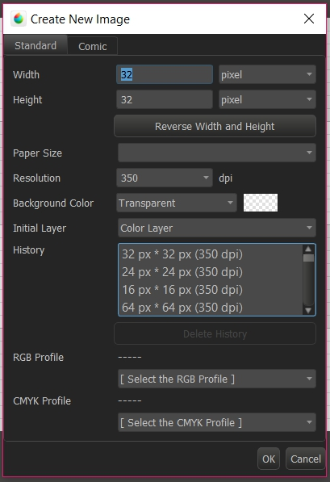

# Pixel Art Using Medibang

## Introduction
Medibang is a free digital art program perfect for beginners. Although it may not have as many features as Adobe Photoshop, it perfectly satisfies most artist needs. This tutorial will do and overview of Medibang's functions and how to use it to make Pixel Art.

***
## Windows

Medibang, similar to most other design programs, is comprised of smaller windows that can either be open or closed, and can be moved around depending on your preference. This is your **workspace**.

Here is a diagram of most commonly found windows:

***
## Canvas
This is where you draw. When you first boot up your program, you may not find this portion. Simply click on `file > new` and create a new canvas with given width and height in either pixels, cm, or inches. You can later change these proportions by going under `Edit > Canvas size`. To **crop** the canvas, you must first select which portion of the canvas you want to keep with the **select tool** and then, go to `Edit > Crop`. To move around the Canvas, you can either drag the side/bottom scroll bars or use the **Navigator**. To zoom in/out, simply scroll down/up respectively.

***
## Navigator
This is where you can "navigate" around your canvas. This also give you an idea of how your entire image looks like without having to zoom out on the Canvas. With the Navigator, you can zoom in/out, rotate, move around the canvas by dragging the red square, and flip the canvas horizontally. Most of these features can also be carried out either directly on Canvas, by using shortcuts, or by going under the `Edit` menu.

If you pay attention, there is another tab occpying the same window as the Navigator. This is the **Reference** window. You can load reference pictures in here.

***
## Layers
Layers are one of the main features of digital art. You can change the opacity of each layer, change its **blending mode**, lock a layer (to prevent further editting), and **clip** layers.

- **Blending modes** define how a layer is blended with its background. For example, a *multiply* blend "multiplies" the colours of that layer to the one underneath (think of it as making the lower layer *darker*), while an *add* blend adds the colours (makes them "lighter"). There are a variety of blending modes and some add very interesting effects. It's worth exploring!
- **Folders** not only organize your layers, but can also group layers to define other layer functions. For example, if you change the opacity of a folder, it will change the opacity of all the layers in that folder.
- **Merge/copy** are self-explanatory.
- **Clipping** allows your layer to be *clipped* to the bottom layer. Let's say you want to add a certain pattern to a dress. Then, you simply add the patter to one layer and colour the dress plainly on another layer and you clip the patter to the dress. This way, only the *painted* part of the dress will contain that pattern and the rest will not be seen. This function has extensively more options in PhotoShop. 

***
## Tools 

All tools have associated functions on the top of the screen that you may explore on your own. 
Here is a brief description of each tool starting from the left:

- **Brush:** this is what you use to draw. Brushes will be explained further in the next section.
- **Eraser:** this is what you use to erase. Unlike the brush tool, the eraser only has a hard tip. Only the size can be modified in *Brush Control* (PhotoShop uses brush tips for the eraser as well).
- **Shape Brush:** draws unfilled common shapes or lines. Straight lines can also be drawn by holding shift at your destination after marking your starting point.
- **Dot Tool:** this is what is used to make Pixel Art. It draws pixel by pixel unlike the brush tool.
- **Move Tool:** moves the selected image in your layer. If nothing has been selected, it simply moves the entire image in the current layer. To transform, press `Ctrl+T`. This can resize your image among other transformations.
- **Fill Tool:** creates a filled common shape.
- **Bucket:** fills a space with the selected colour.
- **Gradient:** creates a gradient of your primary and secondary colours.
- **Select Tool:** selects a section of your image with a rectangle.
- **Lasso:** freely select a section of your image.
- **Magic Wand:** selects all the same nearby colours.
- **Select pen/eraser:** These are modes of selction by brush/eraser. (select with the pen, deselect with the eraser)
- **Text Tool:** creates text with limited fonts.
- **Operation & Divide Tools:** you'll probably never need to use these (I never have)
- **Eyedropper:** select the colour of a distinct area. Use `Alt` when selecting the brush or the dot tool as a shortcut.
- **Hand Tool:** navigate around your canvas freely.

### Associated Tools

As explained before, there exists options for each tool at the top of the prgram window. These are either snaps (for tools like the brush) or shape options (for tools like the selction tools). **Snaps** force your brush strokes a certain direction; either straight, diagonal, or curved. Some of these can be adjusted using the *Snap Settings*.

***
## Brushes

All digital art programs have a variety of brushes to imitate real life brushes and drawing tools. The main brushes are the **pencil**, **watercolor**, **Round** and **Air** brushes.

- The **pencil brush** is good for sketches.
- The **Watercolor brushes** are amazing painting and blending brushes.
- The **Round Brush** is common to all digital art programs and is ideal for line art.
- The **Air Brush** is for finer blending.

Of course, one can download more brushes either online or from the cloud (in the bottom left corner of the brush window). These are fun to explore and get familiar with.

### Brush Control

In this window, you can adjust the size of a brush and some its other properties (depending on the brush). It's best to not mess around with these properties to keep the brush functioning as it usually does. For example, you can change the `opacity` and the `colour mixing level` of a Watercolor brush. These dictate how well it blends with other colours of the same layer. You may get undesirable results if meddling with these options too often.

***
## Color

Finally, this is where you can select your colours! You have 2 optional colours and an "empty colour", which is just another eraser but with brush options. Your selected colour will be outlined with a red border. So make sure you're not accidentally selecting this colour and wondering why your brush isn't working :D
The "empty" colour is espacially useful when working in pixel art since the eraser tool has a soft edge and you don't want some of your pixels to be left transparent.

You may also create your own colour palette by clicking the leftmost palette icon. But it is usually easier to simply have a layer with your palette drawn at the side.

***
## Further Reading

You can download this program for free and watch some tutorials on the [Medibang Websites](https://medibangpaint.com/en/). There are also countless speed paints on YouTube done in Medibang.