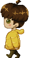

# General Art & Pixel Art Concepts 

## Introduction
If you've taken any Art courses in your academic career, you've probably heard of the "Elements of Design" or "Principles of Design" or at least the "Colour Wheel". Don't worry. This tutorial will *NOT* go over the elements or principles *however*, it will go over some basic concepts of art like how to use colours effectively. It will also cover general practices in Pixel Art, from the most simple ideas like how to draw a diagonal, to more advanced concepts like multiple shading processes.

***
## The Colour Wheel and Colour Theory

This is the Colour Wheel! You can use the **primary colours** to make all the other colours and you can use black and white to add **value** to these colours. The important thing to take away is you can use this wheel to create a **colour palette**. Colour palettes take a small section of the wheel to unify an art piece. These sections can either be **complimentary colours** (colours opposite each other in the wheel), **analogous colours** (colours next to each other) or a combination of both. To see how these colours work together, here is a good [website](https://colorsupplyyy.com/app/) to check out!

Each palette is composed of at least 3 colours, ranging from a colour representing darkness and one representing light. When creating colour palettes, try to stay away from extremely saturated colours like primary red or plain white. Try to blend them more with other primary colours and white or black. **Warm colours** (yellow-red,usually yellow hues) usually represent light in a palette and **cold colours** (purple-green, usually purple hues) represent darkness. Notice how these properties are used in the following simple palette drawings:

And remember, larger and more complex palettes don't necessarily mean better results! It's the simple and small palettes that really bring out the value of an artist :)

***
## Curves and Diagonals in Pixels

### Diagonals
This may be an insignificant concept for traditional artists. However, diagonals are extremely important in pixel art since a diagonal is not a smooth line like a horizontal line. The thing to remember when drawing these tricky lines is to avoid "doubled corners"! These make your lines look **bold** and in pixel art, you want to "save" as many pixel spots as you can and reducing pixels used in diagonals and curves is one of the ways to accomplish this.

      

In `isometric` perspective, we will be mostly using 1:2 ratio diagonals.

### Curves
Curves are a combination of diagonals. Think of them as accelerated diagonals that get mirrored halfway through.

    

***
## Shading in Pixels 

If you use an airbrush in an artprogram and zoom in enough to see how individual pixels work to fade in to the background colour. An airbrush takes your first colour and decreases its oppacity to slowly fade in to the second/background colour. This method provides a smooth transition from one colour to another, but it is not often used in pixel art.

One shading method in pixel art is using intermediary colours (usually 2 or 3) to create an "airbrush" imitation. This method may looks blocky if the transition colours aren't very close to eachother.

Another method is to use "Stippling" (blend in intermediary colours by using random dots instead of blocky transitions).
These methods are demonstrated in the classic sphere:

 

Of course, different textures need different shading methods. So, as you explore various textures, it's good to try out new shading techniques and add detail depending on your resolution.

***
## Resolution and Textures in Pixels

Depending on the Resolution, one can add different levels of shading to define a texture.

You may have heard about 8-bit or 16-bit pixel art. This terminology has multiple interpretations (find out more [here](https://www.youtube.com/watch?v=QaIoW1aL9GE)), but for our purposes, we'll use it to refer to "resolution". So, `8-bit` will mean: `8x8 pixels`. The higher the resolution, the more complicated the design and, potentially, the animation.

***
## Animation

To animate, simply create multiple images (`keyframes`) to give the illusion of movement. **Keyframes** are images where a major change can be seen in your image. **Tweens** are images that contain smaller changes in *between* your keyframes. The more tweens, the smoother your animation will look. To make a gif, create your frames in the art program of your choice, then either use another program to animate, or do it [here](https://gifmaker.me/).

Examples of walking animation:  

### 8 Keyframes:

 
    
   

### 4 Keyframes:

   

There is no need to create a gif for creating animations in our games. All you need to do is create `spritesheets` (a series of frames equally spaced) and hand them to our wonderful Design team to input in the game. (Or learn to do it ourselves potentially)

***
## Cool websites

[Colour Wheel 1](https://colorsupplyyy.com/app/)

[Colour Wheel 2](https://color.adobe.com/create/color-wheel/)

[An explanation behind "bits"](https://www.youtube.com/watch?v=QaIoW1aL9GE)

[Online Gif maker](https://gifmaker.me/)

***
## Further Reading

[Elements and Principles of Design](https://en.wikipedia.org/wiki/Visual_design_elements_and_principles)

[Starting Pixel Art](https://lospec.com/pixel-art-where-to-start)
