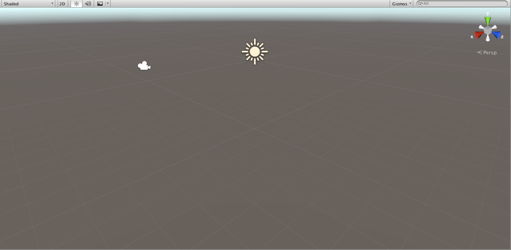

# The Unity Editor

## Introduction
Unity provides a powerful editor for shaping worlds, building scenes, and telling stories. The editor is the home base of everyone working on the game; it's where level designers lay out the game, where modellers test their work in the context of the larger game, and where programmers test their creations. It provides a ton of great tools to developers and designers of all sorts so only the most common ones will be showcased here. That said, but the end of this tutorial, you should feel familiar with the editor itself, it's major functions and it's style

## The Editor
### Overview
When you first open unity, to a blank project, you should see something like the following

Notice that the screen is broken up into 4 different major sections,

**The Scene View**

**The Project View**

**The Hierarchy**

**The Inspector**

As well as having the the typical menus at the top and some further controls just below that. If you're keen, you may also notice some other tabs in the different areas. For example, next to the project view there is a tab labeled `console`. Each area is it's own window and can be resized, moved around, or even made to be floating. Each of the tabs is likewise it's own window. This is the basic structure of the editor, with everything being a docked window grouped into areas as tabs. A window can be opened at any time from the `Window` menu in the top bar. The main windows that you'll be interacting with are the **Scene View**, the **Hierarchy**, the **Project** view, the **Inspector**, the **Game View**, and the **Console**.

### The Scene View
The Scene View is where the the main action takes place. This is where you can move objects around, rotate them, scale them and build the entire scene. Also, when the engine is in play mode you'll be able to see everything play out here and interact with it.

### The Game View
The Game View is what your game will look like and is the view from the camera. When not in play mode, it renders whatever is in front of the camera. In playmode, you'll actually be playing your game. The is the default view when you hit the play button at the top

### The Hierarchy
This is a list of everything in your scene.

### The Inspector

### The Project View

### The Console

## GameObjects

## Components

## Further Reading
