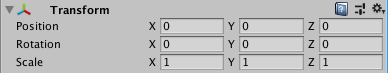
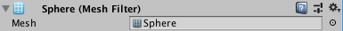
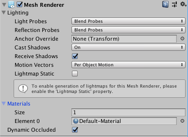
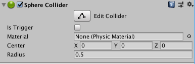
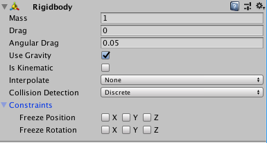

# The Unity Editor

## Introduction
Unity provides a powerful editor for shaping worlds, building scenes, and telling stories. The editor is the home base of everyone working on the game; it's where level designers lay out the game, where modellers test their work in the context of the larger game, and where programmers test their creations. It provides a ton of great tools to developers and designers of all sorts so only the most common ones will be showcased here. That said, but the end of this tutorial, you should feel familiar with the editor itself, it's major functions and it's style

## The Editor
### Overview
When you first open unity, to a blank project, you should see something like the following

Notice that the screen is broken up into 4 different major sections,

**The Scene View**

**The Project View**

**The Hierarchy**

**The Inspector**

As well as having the the typical menus at the top and some further controls just below that. If you're keen, you may also notice some other tabs in the different areas. For example, next to the project view there is a tab labeled `console`. Each area is it's own window and can be resized, moved around, or even made to be floating. Each of the tabs is likewise it's own window. This is the basic structure of the editor, with everything being a docked window grouped into areas as tabs. A window can be opened at any time from the `Window` menu in the top bar. The main windows that you'll be interacting with are the **Scene View**, the **Hierarchy**, the **Project** view, the **Inspector**, the **Game View**, and the **Console**.

### The Scene View
The Scene View is where the the main action takes place. This is where you can move objects around, rotate them, scale them and build the entire scene. Also, when the engine is in play mode you'll be able to see everything play out here and interact with it.

### The Game View
The Game View is what your game will look like and is the view from the camera. When not in play mode, it renders whatever is in front of the camera. In playmode, you'll actually be playing your game. The is the default view when you hit the play button at the top

### The Hierarchy
This is a list of everything in your scene. This is also where you create objects to add them to your scenes. When you first start a project, all that should be there is a `Directional Light` and `Main Camera`. These will be covered in more detail lower down when we discuss `GameObjects`, but they are what a scene starts with. If you're feeling abitious try renaming them or even deleting them.

If you right click in this pain, you'll get a context menu containing some options for copying, pasting, duplicating, etc. As well as the following submenus

- 3D Object
- 2D Object
- Effects
- Light
- Audio
- Video
- UI

As well as a button for `Create Empty` and `Camera`. These tools are used for adding new objects to the scene. Go ahead and select `Sphere` from under the `3D Object` submenu. A sphere should appear in the scene view like so

You should see it also come up in the hierarchy, as seen above. Try creating some more `3D Object`s, and playing around with them. Notice that sometimes, and object will indent under another object like this

This is achieved by right clicking on an already existing object and creating a new object from there, or by dragging an object onto another one in the hierarchy. It can be undone by dragging indented object away from the the one above it. The indented object is called the _child_ and the top one is called the _parent_. In the case in the image, we say the `Cube` is a _child_ of the `Sphere`, and the `Sphere` is the _parent_ of the `Cube`. Notice that in the scene view, when you move the parent around, the child moves with it. This can be helpful for creating composite objects, or grouping similar objects together.

The last thing to note is the lowly `Create Empty` button that was mentioned earlier and promptly ignored. It simply creates and object that only hold position, rotation, and scale information. This is most useful as a parent to composite objects or groups of things. It's called an `Empty GameObject`.

### The Inspector
You might have noticed that the empty grey box to the right of the screen lights up with information whenever you click on a object in the hierarchy or in the scene view. This is the inspector, and it gives you fine-grained control over the object in question. If you click on the sphere, it should look something like the following

The topmost box controls position, rotation, and scale data of an object. Try changing these values and notice what happens in the scene view. More attributes can be added to an object by clicking the big `Add Component` button and find the component you wish to add. A more full discussion of components deserves a section all it's own but suffice it to say, whenever it comes to customizing objects it'll be done in this right most pane.

### The Project View
This is your bog standard file explorer, and it lets you see all the files associated with your project. You'll notice a folder called `Scenes`, in which is a file called `SampleScene.unity`. That corresponds to all the data of the current scene, all the `GameObject`s in the scene and all their properties. It's nice to save often. You can have as many scenes as you want.

#### Assets
In general, we refer to files associated with the project as assets. This includes such things as textures, images, audio files, models, and scripts. It also includes some more unity specific things, for example, materials and prefabs.

##### Materials
Materials are how you add colour and texture to an object. A complete discussion of them is beyond the scope of this tutorial, but you can create one by right clicking and selecting `Create > Material`. Give it a name you like. Once it has been created, try dragging it onto and object (Be it in the hierarchy, the inspector, or in the scene view). Click back on the material and start playing around with its properties, notice how the object it was attached to is affected

##### Prefabs
Click on any object in the hierarchy, preferably a composite one (One with children) and drag it down into the project view. Congrats! :tada: You just made a prefab. It's basically a template for creating objects. You can drag as many copies of it as you want into the scene. Also, whenever you change the prefab all the objects made from the prefab will be changed in the same way as well. Really helpful for managing several objects that are meant to be the same.

### The Console
This last section is easiest to talk about. This is where important debug information shows up, warnings, exceptions, compiler errors, and and debug output from scripts. We'll talk about this somewhat further when discussing scripts themsevles.

## GameObjects
`GameObjects`, as you might have up to this point gathered, are the heart and soul of unity. Everything is a `GameObject` in unity. They are what exist in the scene, and what do all of the work. A `GameObject` is defined by `Component`s that are attached to it. You might have noticed earlier the `Transform` component, which comes at the top of most `GameObject`s. This is just one one example of a component, and it happens to be shared by all `GameObects`s. What follows is a discussion of what a component is and some useful components in unity

### Components
A component adds some functionality to a `GameObject`, giving it shape or substance, or even defining how it looks. In fact, components can do anything you might imagine and user-defined components are how we make games. If you click on the `Sphere`, you'll notice it has 4 components. It has a `Transform`, a `Sphere (Mesh Filter)`, a `Mesh Renderer`, and a `Sphere Collider`. The material looks like a component, but in fact it is a field of the `Mesh Renderer`.

#### Transform

The `Transform` just holds position, scale, and rotation data of an object. An object can be transformed in all axis independently, and all of the coordinates are represented in world space. That is say, an object at `(0, 0, 0)` is at the centre of the world.

#### Mesh Filter

the `Mesh Filter` specifies the shape that the `GameObject` has. By itself, this component doesn't do much but can be used by other components (ie: `Mesh Renderer`, `Mesh Collider`) for its geometry data. It's the component that corresponds most directly to the models that artists make.

#### Mesh Renderer

This component concerns itself with making objects appear on the screen. It uses the geometry data from the `Mesh Filter` to decide the shape of the object, and it uses a material to determine how the shape looks and how it's affected by lighting.

#### Collider

This component is needed only in the event that you wish to have something happen when two objects collide. There are a handful of basic colliders, `Box Collider`, `Sphere Collider`, and `Capsule Collider`. An object can have as many colliders as you wish, and they can all be edited so as to best approximate the shape of the object. This is tedious, but gives the best results for collisions detections. Alternatively, there is a `Mesh Collider` that will generate a collider based on the geometry data of the associated `Mesh Filter`.

As can be seen, objects are merely the composition of their components. There is one other component that I would like to mention, as it is quite ubiquitous and you are quite likely to need it. It is called a `Rigidbody`. To add it, simply click the big `Add Component` button and search for `Rigidbody`. Once you find it, click on it and it will be added.

#### Rigidbody

Any object that has a `Rigidbody` applied to it will have physics applied to it. Most of the options behave as you would expect them to, I encourage you to play around with them to see what the do. One key attribute, however, is the `Is Kinematic` switch. Kinematic rigidbodies will have all the physics calculations done, but won't be moved by the physics. This is important because for unity to detect collisions, at least one of the objects in the collision needs to have a `Rigidbody` (and both need colliders).

Later, we will be defining our own components with custom functionality, and they will appear in the inspector very similarily to what to the ones shown here

## Further Reading
[Unity Manual](https://docs.unity3d.com/Manual/index.html)

[A Great Youtuber for Unity](https://www.youtube.com/user/Brackeys)

[A More Advance Youtuber](https://www.youtube.com/user/Cercopithecan)
